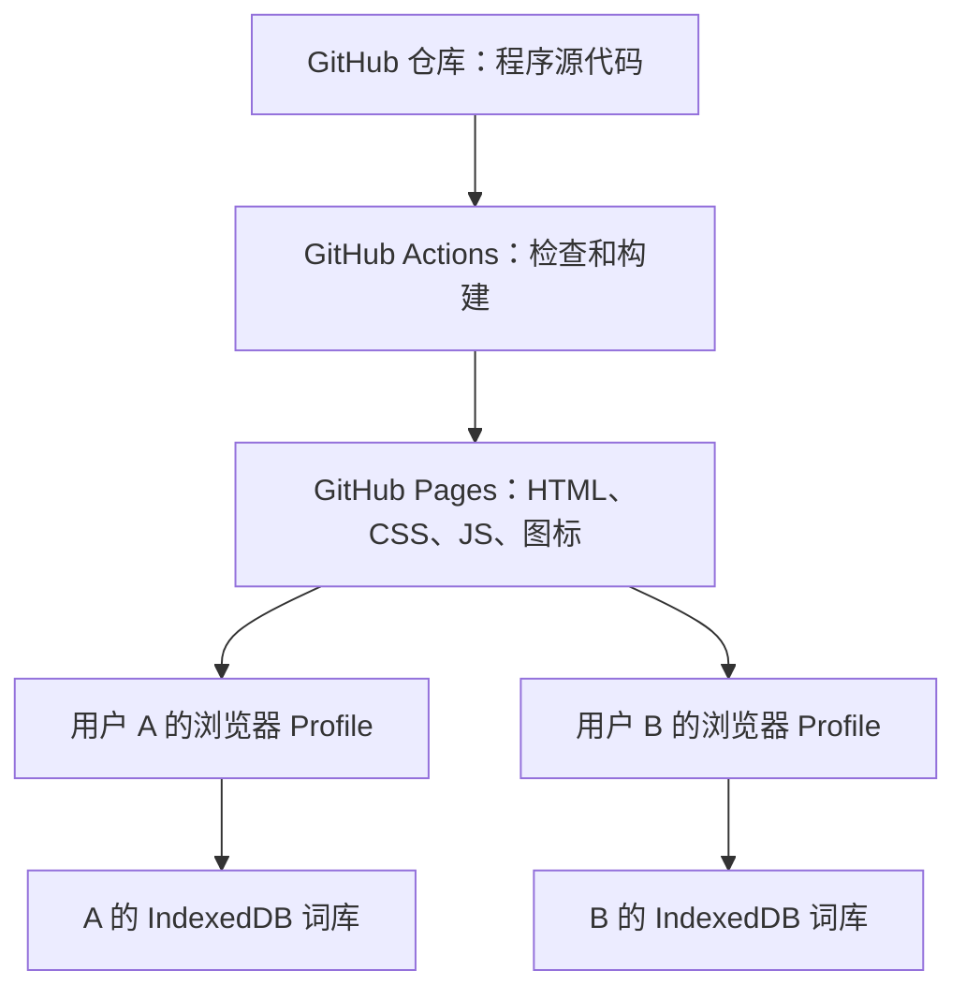

# VocabularyApp 在线部署版详细说明与后续优化报告

- **报告日期：2026 年 10 月 7 日（Asia/Shanghai）**
- **报告范围：第一版已有功能 + 第二阶段第一部分公开部署成果**
- **报告编写前代码基线：`24e44aa8e8462ff3d2feed2f6866eb36a6c19c91`**
- **实际网站部署基线：`4bd1d27c320cb4485c0a8dbca045c6b3bd237397`**
- **本地项目：`D:\VocabularyApp`**

当前版本已从需要本机启动的个人词库，升级为可通过固定 HTTPS 网址直接使用的 Web App。用户无需安装 Node.js、下载项目或运行 npm，即可搜索、添加和整理自己的词条。

在线地址：[VocabularyApp](https://lnlsn-l.github.io/VocabularyApp/)

代码仓库：[lnlsn-l/VocabularyApp](https://github.com/lnlsn-l/VocabularyApp)

本报告根据当前代码、README、部署配置、已有验收记录和报告编写时的状态复核整理。后续优化部分是待选择的方案，尚未开发；本次仅新增说明报告和文档入口，不改变应用功能或个人数据。

## 一、当前版本的定位和完成状态

VocabularyApp 服务于英文文献阅读，尤其适合电子信息相关专业的单词、术语和短语积累。中文释义由用户按论文语境手动填写，避免把专业理解完全交给通用词典。

典型流程为：阅读论文 → 搜索个人词库 → 已收录则打开详情 → 未收录则添加 → 后续修订释义、备注或学习状态 → 定期导出备份。

| 项目 | 当前实际状态 |
| --- | --- |
| 使用方式 | 直接访问固定 HTTPS 网站，也可继续本地运行 |
| 网站 | `https://lnlsn-l.github.io/VocabularyApp/` |
| 发布方式 | GitHub Actions 构建并部署到 GitHub Pages |
| 仓库可见性 | Public，已取得用户明确授权后变更 |
| 默认分支 | main |
| 数据保存 | 当前浏览器 IndexedDB，通过 Dexie 管理 |
| 数据同步 | 无自动跨设备、跨浏览器同步 |
| 备份与迁移 | 用户主动导出／合并导入 JSON |
| 账户与业务服务器 | 无注册登录、业务后端或云数据库 |
| 外部业务服务 | 无词典、翻译、AI、分析或广告 SDK |
| 离线启动 | 未实现 PWA 或 Service Worker |
| 当前版本标识 | package.json 仍为 1.0.0；本报告按开发阶段命名 |
| 数据兼容 | Dexie schema version 1，JSON version 1 |

“在线部署版”指本阶段产品状态，并不表示数据库升级到了 version 2。此次没有新增词条字段，也没有删除、重建或升级已有数据库。

## 二、这一阶段带来的变化

第一版已经建立添加、检索、学习状态、统计和备份的使用闭环。本阶段重点是让这个闭环能够通过网址使用，同时保留本地数据机制。

| 方面 | 第一版状态 | 当前状态 |
| --- | --- | --- |
| 日常启动 | 本机启动开发服务器或静态预览 | 普通用户直接打开在线网址 |
| 网页提供方 | 本地 Vite 服务 | GitHub Pages HTTPS 静态托管 |
| 生产资源路径 | 面向本地预览 | 正确适配 `/VocabularyApp/` 子路径 |
| 发布操作 | 本地构建与手工维护 | main 应用提交触发自动检查与部署 |
| 数据解释 | README 和底部简短提示 | 新增可长期展开的“数据说明” |
| 首次空词库 | 主要提示添加 | 同时提供“导入 JSON 备份”入口 |
| 验收范围 | 本地持久化与功能测试 | 新增真实 Pages、独立 Profile 和双向迁移测试 |

原有数据访问分层、搜索规则、学习状态、删除确认和备份格式均保留。部署没有把个人数据库转换为共享在线数据库。

## 三、当前功能的详细说明

### 3.1 添加、编辑与重复处理

词条表单包含英文词汇／短语、中文释义、备注和学习状态。英文与中文释义必填；备注可以为空；新增默认“学习中”。

点击“保存”后才写入 IndexedDB，成功后列表自动更新。这里的保存不包括输入过程中的自动草稿保存。保存失败时保留当前表单内容，并给出可读的错误提示。

保存前去除英文、释义和备注的首尾空格。重复判断采用英文内容的 `trim + lowercase`，例如 `substrate`、`Substrate`、` SUBSTRATE ` 被视为同一个词。显示时保留用户输入的大小写。

内部空格、单复数和词形变化不会自动合并。例如 `carrier mobility` 与 `carrier  mobility` 目前仍可被视为不同内容。重复提示提供查看已有词条的入口；编辑也不能把一个词改成另一个现有词的名称。

编辑更新内容或状态的修改时间，保留创建时间和查看统计。界面和数据层同时处理去重，数据库唯一索引与事务防止并发操作绕过规则。

### 3.2 搜索和组合筛选

一个搜索框同时匹配英文、中文释义和备注，输入后实时更新结果。英文忽略大小写，支持完整、前缀及中间部分匹配。

| 输入 | 示例效果 |
| --- | --- |
| sub、strate、SUB | 可找到 substrate |
| ele、interference | 可找到 electromagnetic interference |
| 电磁、干扰 | 可找到含“电磁干扰”的释义 |
| 半导体、微波 | 可匹配含这些内容的备注 |

状态筛选提供“全部”“学习中”“已掌握”，默认显示学习中。字母筛选提供“全部字母”、A–Z 和 `#`；数字或特殊字符开头进入 `#`，短语按整个词条的开头分类。

查询、字母和状态必须同时满足。例如“学习中 + E + electro”只返回满足三项条件的记录。“清除筛选”清空查询、恢复全部字母和全部状态，保留排序选择。

“当前结果数 / 总词条数”中的总数是整个词库大小。看到 0 条结果可能是筛选造成的，不表示数据库为空。无结果图标会显示当前字母；全部字母状态显示 `Aa`。

### 3.3 排序和查看统计

| 排序选项 | 实际规则 |
| --- | --- |
| 英文 A–Z | 按英文名称排序，忽略大小写差异 |
| 最近添加 | 创建时间从新到旧 |
| 最近查看 | 最后查看时间从新到旧，未查看的记录靠后 |
| 查看次数最多 | 查看次数从多到少 |

排序指标相同后按英文名称、稳定 ID 继续比较，保持结果稳定。结果只有 0 或 1 条时，切换排序不会造成可见位置变化。

`searchCount` 实际表示“打开词条详情的次数”，不是输入搜索次数。点击英文标题或重复提示的查看入口才增加计数并记录最后查看时间。搜索结果展示、编辑、状态切换和刷新不增加次数；查看也不改变内容修改时间。

### 3.4 学习状态和删除

标记“已掌握”后，词条退出默认学习中列表，但仍在数据库中，可以通过全部或已掌握查看。“重新学习”将其恢复为学习中。

永久删除需要二次确认。取消或 Esc 不删除记录；确认成功后真正移除。当前没有回收站或撤销，恢复需要删除前的 JSON 备份。

### 3.5 使用反馈与移动端

应用处理加载、空库、筛选无结果、保存成功、导入统计和存储错误。IndexedDB 初始化失败提供重试；异步保存或删除时禁用相关按钮，减少重复提交。

弹窗支持关闭、取消和 Esc，使用原生 dialog 管理焦点。桌面及约 360px 手机宽度已验证，长短语可换行。手机用户可以通过浏览器使用，但没有原生手机 App。

“数据说明”默认折叠，不会每次强制弹窗；用户可以长期查看存储、备份、同步和 Origin 规则。空词库提供添加与导入入口，网站不会自动寻找电脑中的备份文件。

## 四、数据在哪里，为什么不同人不会互相干扰

### 4.1 程序、网页和数据的职责



所有人加载相同的网页程序，各自的数据保存在各自浏览器中。数据库名称相同不代表数据共享：每个独立浏览器环境都有自己的站点存储。

| 使用情形 | 词库关系 |
| --- | --- |
| 不同人在各自电脑打开同一网址 | 各自独立 |
| 同一电脑使用不同浏览器 Profile | 各自独立 |
| 同一电脑共用同一个 Profile | 共用该 Profile 的词库 |
| 同一人换浏览器或换设备 | 得到另一套独立词库，不自动同步 |
| 同一 Profile、同一地址打开多个标签页 | 访问同一套数据，列表通过订阅更新 |

当前没有用户账号。隔离依据是浏览器环境和站点 Origin，不是网站识别了每个人的身份。不要把共享电脑的同一 Profile 当作独立用户空间。

### 4.2 数据模型

数据库名为 `VocabularyDB`，表名为 `vocabulary`，使用 Dexie version 1。

| 字段 | 用途 |
| --- | --- |
| id | 稳定词条 ID，应用新增时生成 UUID |
| word | 英文单词、术语或短语 |
| meaning | 用户维护的中文释义 |
| note | 可选语境或阅读备注 |
| status | learning / mastered |
| searchCount | 真正打开详情的累计次数 |
| createdAt | 创建时间 |
| updatedAt | 内容或状态最后修改时间 |
| lastSearchedAt | 最后打开详情时间，未查看时可为空 |

数据库内部还有 `normalizedWord` 唯一索引，用于去重，不进入页面业务模型或 JSON 备份。

数据位于浏览器用户配置文件的站点存储，不在 `D:\VocabularyApp\src`、GitHub 仓库或 Pages artifact 中。普通用户不需要手动操作数据库文件。

### 4.3 Origin 和保存边界

Origin 由协议、主机名和端口组成。以下两套存储独立：

- 本地：`http://localhost:5173`。
- 在线：`https://lnlsn-l.github.io`。

`/VocabularyApp/` 是路径，不是新的 Origin。同一 `https://lnlsn-l.github.io` 下的其他项目路径通常共用站点存储；不能将路径当作应用间的独立存储安全边界。

刷新、关闭标签页以及关闭浏览器进程重开后保存能力已验证。没有实际重启用户电脑，也没有承诺永不丢失。清理网站数据、删除 Profile、系统重装、隐私模式或浏览器存储回收等仍可能导致数据丢失。

当前没有申请持久存储权限，也没有外部自动备份。浏览器存储的配额和回收行为取决于浏览器，用户主动清除数据仍会影响词库。依据：[MDN 存储配额与回收说明](https://developer.mozilla.org/en-US/docs/Web/API/Storage_API/Storage_quotas_and_eviction_criteria)。

## 五、JSON 导出、保存位置和恢复规则

### 5.1 导出会保存在哪里

点击“导出词库”后，应用读取整个词库，生成下载文件 `vocabulary-backup-YYYY-MM-DD.json`。日期按浏览器本地日期生成，不是只导出当前搜索或筛选结果。

通常保存到浏览器设置的“下载”文件夹；若开启下载前询问保存位置，可自行选择。具体位置取决于使用的浏览器或内置浏览器的下载设置，应用不能凭一次点击知道最终文件保存在哪里。

**不会自动保存到 `D:\VocabularyApp\backups`。** 该目录只是预留给你手工整理备份：可在保存对话框选择它，或下载后手动移动文件。其他访问者可以选择自己的目录，不需要拥有你的项目路径。

网站不会把备份上传到 GitHub 或服务器，也不会自动写入任意磁盘目录。建议保留一份项目目录之外的副本。JSON 是普通可读文本，本版没有备份加密。

### 5.2 格式与合并导入

第一版和在线版继续使用相同外层结构：

```json
{
  "version": 1,
  "exportedAt": "2026-10-07T00:00:00.000Z",
  "app": "VocabularyApp",
  "entries": []
}
```

以上为空示例，不是个人备份。真实 entries 保留释义、备注、状态、ID、查看次数和时间，不包含内部 normalizedWord。

| 导入情况 | 当前行为 |
| --- | --- |
| JSON 无法解析、版本或外层结构不符 | 拒绝整个文件 |
| 单条必要字段无效 | 跳过该条并计入无效数量 |
| 新词 | 合并写入，保留有效元数据 |
| 当前库已有同名词 | 跳过，保留目标库原有内容 |
| 文件内部同名重复 | 只接受首条有效新词，其余计为重复 |
| 不同词发生 ID 冲突 | 给新词重新分配 UUID，保护旧记录 |
| 写入中途失败 | 整个合并事务回滚 |

支持 UTF-8 BOM，界面限制单文件 20 MB。导入后显示成功、重复和无效三项数量。选择文件后直接执行合并，当前没有导入预览或完全覆盖恢复。

合并不意味着覆盖已有数据。例如目标库的 substrate 已改成新释义，导入较旧备份中的同名词不会把它还原成旧释义。这是当前保护目标库的规则，也限制了“精确回到某次备份”的能力。

### 5.3 localhost 到在线网站的迁移


1. 使用原浏览器和 Profile 打开 `http://localhost:5173/`；必要时先启动本地项目。
2. 点击“导出词库”，确认文件已保存，并保留副本。
3. 打开 [在线 VocabularyApp](https://lnlsn-l.github.io/VocabularyApp/)。
4. 点击“导入 JSON”或空库的“导入 JSON 备份”，选择文件。
5. 查看导入统计，切换到全部／清除筛选，核对总数，并抽查备注、状态和查看统计。
6. 确认无误后再决定是否继续使用旧地址，保留外部备份。

此流程同样适用于换浏览器、换设备，以及在线版本导回本地版本。新地址空库不表示旧数据被删除；应用不会跨 Origin 自动读取或清空旧库。

测试已验证迁移机制，但没有代你迁移日常个人词库。你的真实数据仍需由你在原环境主动导出并选择文件导入。

## 六、公开部署和代码维护

### 6.1 仓库公开的含义

第一版仓库为 Private。当前账户的方案不支持该私有仓库 Pages，初次创建被 HTTP 422 拒绝。先完成部署准备并说明限制，收到“变成public即可”的明确授权后才改为 Public。

公开的是源代码、配置和 Git 历史，Pages 提供构建后的网页。个人浏览器数据库不是仓库的一部分，因此不会随可见性变更公开。部署检查也确认 artifact 没有个人词库、JSON 备份、Profile 或测试输出。

当前没有为本阶段购买服务或加入付费业务 API；采用公开仓库的免费 Pages 托管。`package.json` 中 `private: true` 用于阻止误发布 npm 包，与 GitHub 仓库 Public/Private 是两个不同概念。

### 6.2 Vite 路径适配

| 环境 | base | 地址 |
| --- | --- | --- |
| 本地开发 | `/` | `http://localhost:5173/` |
| 本地生产预览 | `/VocabularyApp/` | `http://localhost:5173/VocabularyApp/` |
| GitHub Pages | `/VocabularyApp/` | `https://lnlsn-l.github.io/VocabularyApp/` |

build 与 preview 的 base 在 Vite 配置中统一处理，favicon 使用 `%BASE_URL%favicon.svg`，JS/CSS 由 Vite 生成正确路径。当前没有客户端路由，不需要引入 React Router。

开发和默认预览使用相同 Origin，所以原 localhost 数据继续沿用。两个服务不能同时占用 5173；端口冲突时明确退出，不自动换端口。

### 6.3 自动部署与发布门槛

应用修改推送 main 后，工作流执行：

```text
checkout → Node.js 24 → npm ci → lint → 单元测试
  → 安装 Chrome → 开发 E2E → 生产构建
  → 生产子路径／迁移 E2E → 部署产物检查
  → 上传 dist → configure-pages → deploy-pages
```

检查失败则不能进入后续发布步骤。仅 README/docs 修改不重复部署，也可手动 workflow_dispatch。dist 不提交到 main，部署产物只包含 HTML、JS、CSS 和图标。

工作流使用官方 Actions，并固定提交 SHA。全局只读代码权限；部署 job 增加 Pages 写权限和 OIDC 权限，不使用 write-all 或硬编码凭据。

本次成功发布：[Actions 37570191550](https://github.com/lnlsn-l/VocabularyApp/actions/runs/37570191550)。实际发布基线为 4bd1d27；之后 24e44aa 只更新上线文档，因此当前主分支比发布基线多文档提交，应用内容相同。

### 6.4 技术结构和本地维护

React UI → VocabularyService → VocabularyRepository → LocalVocabularyRepository → Dexie → IndexedDB。

UI 不直接写数据库；校验、备份解析和搜索集中管理。React 状态负责显示，IndexedDB 负责持久保存；liveQuery 订阅刷新同 Origin 内的数据变化。

运行依赖仍为 React、React DOM、Dexie；开发工具包括 TypeScript、Vite、ESLint、Vitest、fake-indexeddb、Playwright。本阶段没有新增依赖。未来 schema 变更需要 Dexie 版本迁移，不能通过删除数据库处理升级。

```powershell
cd D:\VocabularyApp
npm ci
npm run dev
```

构建与预览：`npm run build`、`npm run preview`。普通在线用户不需要这些步骤。部署与故障排查的完整操作见 [deployment.md](deployment.md)。

## 七、已经验证什么，尚未验证什么

| 验收项 | 已记录结果 |
| --- | --- |
| TypeScript 与生产构建 | 通过 |
| ESLint | 通过 |
| 单元／数据层测试 | 3 个文件、21 项通过 |
| 原有开发 Chrome E2E | 11 项通过 |
| 原有生产预览 UI E2E | 8 项通过 |
| 新增本地生产／迁移 E2E | 4 项通过 |
| 实际 Pages HTTPS E2E | 4 项通过，11.9 秒 |
| Linux Actions build/deploy | 成功，分别 54 秒与 13 秒 |
| JS/CSS/favicon 和资源错误 | 真实 Pages 正常，无相关 404 或 console error |
| 1440px / 360px 页面、表单、详情 | 自动化及截图检查通过 |
| IndexedDB 刷新、标签页及浏览器进程重开 | 保留测试词条 |
| 两个独立 Chrome Profile | 一个环境的词条不出现在另一个环境 |
| localhost → Pages JSON | 全部词条元数据逐字段一致 |
| Pages → localhost JSON | 格式兼容，合并与去重符合规则 |
| 实际下载与文件选择 | HTTPS 环境正常 |
| Pages artifact | 只有四个静态文件，无个人数据和测试 Profile |

不同环境会执行部分相同测试，因此表中数量不是互不重复用例的总数。完整过程见 [stage2-part1.md](stage2-part1.md) 和 [verification.md](verification.md)。

本报告编写时再次只读核对：仓库为 Public，Pages 公开且 HTTPS 已启用，成功工作流状态未变；独立 Chrome 访问返回 HTTP 200，应用标题正常。本次没有重新运行上述整套历史测试，也没有触碰日常个人词库。

目前未验证实际电脑重启、所有浏览器及手机型号、大规模词库压力、长期连续运行或多设备同步。新增线上验收使用独立测试 Profile，验证的是机制，不表示真实个人数据已迁移或备份。

## 八、当前能力边界

| 方面 | 当前边界与影响 |
| --- | --- |
| 数据保护 | IndexedDB 加手动 JSON，没有外部自动副本 |
| 导出反馈 | 只确认发起下载，不能确认最终目录和外部副本是否保存成功 |
| 恢复 | 合并并跳过同名词，没有覆盖恢复、预览或回滚快照 |
| 删除 | 二次确认，没有撤销或回收站 |
| 跨设备 | 手动 JSON 迁移，不能实时同步编辑和删除 |
| 网络 | 本地业务不调用远程服务，但远程页面重新加载没有离线保障 |
| 搜索 | 字符串匹配，无拼写纠错、词形还原或搜索命中高亮 |
| 专业信息 | 只有通用备注，没有标签、论文来源或原句字段 |
| 操作效率 | 无连续添加、专用快捷键或复制入口 |
| 筛选与设置 | 条件未跨刷新记忆；缺少更明确的条件及排序说明 |
| 性能 | 加载词库后在浏览器筛选排序，未做大库压力测试 |
| 账户 | 无登录和身份隔离，共用 Profile 的人共用数据 |

本阶段没有开发 AI、在线词典、翻译、发音、复习算法、PDF、扩展、原生 App、PWA 或云同步。它们可以继续评估，但不能当作现有能力。

## 九、下一步优化候选与优先级

下列优先级是结合当前代码及本次“数据隔离、备份保存位置”使用问题作出的工程建议，不是已经确认的下一阶段范围。复杂度为相对判断，不是工期承诺。

| 优先级 | 候选方案 | 主要收益 | 建议范围 | 复杂度 |
| --- | --- | --- | --- | --- |
| P0 | 备份保存说明与状态 | 让用户知道下载到哪、是否需要保管 | 导出提示、备份帮助、最近发起导出时间 | 低 |
| P0 | 适度备份提醒 | 降低长期忘记导出的概率 | 轻量提醒、可关闭、变更提示 | 中 |
| P1 | 导入预览与冲突说明 | 导入前知道会新增或跳过什么 | 新增／重复／无效统计，重复内容差异，确认合并 | 中 |
| P1 | 筛选和排序反馈 | 避免空列表被理解成数据丢失 | 条件摘要、逐项清除、排序规则及少量结果说明 | 低 |
| P1 | 阅读操作效率 | 减少来回点击和重复输入 | 搜索聚焦、添加快捷入口、连续添加、复制 | 低至中 |
| P2 | PWA 与离线启动 | 方便手机使用和断网重新打开 | 安装、离线资源缓存、更新提示 | 中至高 |
| P2 | 专业标签和论文来源 | 分类专业知识并追溯语境 | 可选标签、论文标题／链接、相关原句 | 中 |
| P2 | 性能与浏览器兼容验证 | 明确扩大词库后的体验边界 | 实测后决定分页／虚拟列表，扩大浏览器覆盖 | 中 |
| 后续独立阶段 | 云同步、词典、AI、PDF | 解决新的使用流程 | 每项单独确认需求和数据处理规则 | 高或不确定 |

### 9.1 首先改进备份的可理解性

导出完成提示可明确写“已发起下载，请在浏览器下载列表中查找”，说明不会自动写入 backups，并给出查看或自行设置下载目录的方法。这样直接解决当前已经出现的使用疑问，不需要改变数据库或备份格式。

记录最近导出时间时，应称为“最近发起导出”，不能据此断言文件成功保存到某个磁盘。变更提示也要覆盖删除和导入，不能只用最新 updatedAt 判断；查看统计是否计入“待备份变化”应先明确，避免状态含义模糊。

如以后提供“另存为”入口，可评估 `showSaveFilePicker()`，但须保留现有下载方式作为兼容回退。该接口需要用户交互、安全上下文，且部分常用浏览器不支持，不能据此设计无提示的后台自动写盘。依据：[MDN 文件保存选择器](https://developer.mozilla.org/en-US/docs/Web/API/Window/showSaveFilePicker)。

可以单独评估持久存储申请，显示是否获准；浏览器可能拒绝。它不能替代 JSON 备份，也不能保证用户主动清除数据后仍保留。依据：[MDN persist()](https://developer.mozilla.org/en-US/docs/Web/API/StorageManager/persist)。当前没有调用这些新增能力。

### 9.2 导入预览保持现有安全合并规则

先显示新增、重复、无效数量，再让用户确认执行；重复词显示“保留现有内容”的说明，并按需展示释义、备注等差异。文件内重复也应计入预览。

预览与确认之间可能有其他标签页写入，实际事务中仍要重新校验。若结果变化，必须解释或重新确认，不能盲信旧预览。第一版 JSON 必须继续支持，导入失败仍应完整回滚。

默认继续合并，不宜为了预览顺手加入全库覆盖。若以后需要覆盖恢复，应独立设计影响说明、先备份和再次确认。同库快照会随网站数据清理一起丢失，不能冒充外部备份。

### 9.3 提高查询与添加效率

显示“学习中／E／查询 electro”等当前条件，允许清除单项，说明排序规则。结果少于两条时可提示排序没有位置变化，降低误解。

连续添加可以在成功保存后清空表单并保留弹窗；失败时保留内容。快捷键应避开浏览器常用组合和中文输入过程，并提供可发现的提示。复制英文或释义可用于论文阅读，但要处理复制失败，不依赖业务后端。

如果以后记忆筛选和排序，应说明恢复后的默认行为，避免首次使用者看到空列表却不知道条件已保存。建议先从排序偏好开始，不必默认持久保存每一次搜索词。

### 9.4 PWA 应作为单独阶段

固定 HTTPS 地址已具备，下一步可评估安装入口、应用图标、资源缓存和更新提示。缓存可以支持离线使用，也带来版本新鲜度与更新策略问题，需要按资源决定缓存方式。依据：[MDN PWA 缓存指南](https://developer.mozilla.org/en-US/docs/Web/Progressive_web_apps/Guides/Caching)。

验收应包含首次在线加载后断网重开、离线增删改查、更新提示、旧缓存清理及数据库兼容。Service Worker 范围需正确限制在项目路径；清理应用缓存不能清空 IndexedDB。PWA 不自动带来云同步，也不替代数据备份。

如果实际使用的主要痛点是手机启动或断网重开，可以提高 PWA 的优先级；如果主要担心数据和导入，先完成备份及导入预览更合适。

### 9.5 专业标签与来源记录

标签可表达半导体、电路、电磁场、通信等领域；来源可记录论文标题、链接和词条出现的原句。先使用少量可选字段，历史记录无需补齐。

这类变化才需要正式讨论 schema 和备份版本迁移。旧词的 ID、状态、统计与时间应保留，旧 JSON 仍可导入。若新 JSON 增加字段，还要说明旧版导入能否保留新信息，不能仅以“能够解析”宣称完整向后兼容。

云同步需要另外设计身份认证、修改冲突、删除传播、离线行为和导出退出方式。在线词典、AI 或 PDF 也需要独立确定数据会发往哪里；不能延用当前“无远程词库处理”的说明而不作调整。

## 十、建议的下一阶段组合与验收条件

建议下一阶段优先选择：**备份保存说明与轻量提醒 + 导入预览 + 筛选／排序反馈**。这组改进直接服务当前使用问题，能够继续保持纯前端、IndexedDB 和固定网址的架构。

实施可以分三批：先完善导出与备份说明，再加入导入预览与并发重校验，最后改进条件反馈。每批独立验证和提交；PWA、专业字段或云同步另行确定范围。

未来阶段至少应满足以下验收条件：

1. 原词条 ID、释义、备注、状态、查看统计和时间在升级后保留，不通过删库升级。
2. 第一版及当前在线版的 JSON 继续可导入，原合并保护策略不被无意改变。
3. 导出提示准确区分“发起下载”和“文件已保存”，不承诺自动磁盘备份。
4. 导入预览与实际结果一致，出现并发变化时重新校验，并保持事务回滚。
5. 提醒不强制打断搜索和添加，不让普通使用依赖登录或付费服务。
6. 新增专业字段可选，来源文字和链接正确处理，不要求用户补齐历史记录。
7. 本地开发、生产子路径、真实 HTTPS、独立 Profile 和 360px 布局继续正常。
8. 若选择 PWA，额外验证离线重开和更新；若选择同步，重新明确数据处理与隐私边界。

本报告提出选择依据，不包含新增功能实现。下一阶段应根据实际使用反馈确定最终任务。

## 十一、报告依据和维护位置

| 文档／代码 | 用途 |
| --- | --- |
| [README.md](../README.md) | 在线入口、运行与迁移操作 |
| [requirements.md](requirements.md) | 第一版正式需求 |
| [v1-report.md](v1-report.md) | 第一版历史说明和候选规划 |
| [stage2-part1.md](stage2-part1.md) | 本阶段具体修改、提交与验收记录 |
| [deployment.md](deployment.md) | 发布、重跑与故障排查 |
| [verification.md](verification.md) | 第一版验收覆盖及边界 |
| src/types、db、repositories、services、utils | 数据模型、保存、统计、备份和搜索的实现依据 |
| tests/app.spec.ts、tests/pages.spec.ts | 本地与真实网站验收代码 |
| .github/workflows/deploy-pages.yml | 自动部署及质量门槛 |

本报告应随以后产品变化更新“已实现”与“候选方案”的边界；历史验收记录保留对应基线。此处没有真实个人词库、下载文件或用户 Profile 内容。
